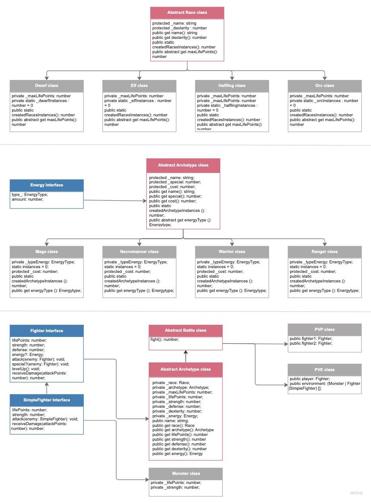

# Dragons Universe #


## About ##

In this project, the principles of SOLID architecture and OOP principles were used to create the structure of role-playing games, better known as RPG games (Role Playing Game).

## Class Diagram ##



## Skills and Tools ##
* Docker
* Typescrip
* Nodejs
* Use the Object Oriented Paradigm (OOP);
* Use the SOLID principle;

## Guidelines to runnig API ##

### :whale: Docker ###

1. Clone the repository: ```git clone git@github.com:carinacunha/dragons-universe.git```
2. Navigate to the root of the repository: ```cd dragons-universe ```
3. Initialize the Docker containers: ```docker-compose up -d```
4. Acess of container interactive terminal ```docker exec -it trybers_and_dragons bash```
5. Install the dependencies: ```npm install ```

### :computer: Local ###

1. Clone the repository: ```git clone git@github.com:carinacunha/dragons-universe.git```
2. Navigate to the root of the repository: ```cd dragons-universe ```
3. Install the dependencies: ```npm install```

**✨ This project was developed during the Full Stack Web Development course at Trybe**
